# Analyzing Sales Performance of Dyson Products on eBay Ireland vs eBay US

## Table of Contents
- [Repository structure](#repository-structure)
- [Technologies used](#technologies-used)
- [Purpose](#purpose)
- [Key Findings](#key-findings)
  - [Marketplace Comparison](#marketplace-comparison)
  - [Category Comparison](#category-comparison)
  - [Items Condition Comparison](#items-condition-comparison)
  - [Seller Analysis](#seller-analysis)
  - [Review Insights](#review-insights)
- [Recommendations](#recommendations) 
  - [Marketplace Expansion and Competitiveness](#marketplace-expansion-and-competitiveness)
  - [Product-Specific Strategies](#product-specific-strategies)
  - [Seller Strategy](#seller-strategy)
  - [Customer Experience Enhancement](#customer-experience-enhancement)
- [Data Collection](#data-collection)
  - [Data Sources](#data-sources)
  - [Data Collection Process](#data-collection-process)
  - [Challenges](#challenges)
- [Database Structure](#database-structure)
  - [Database Storage](#database-storage)
  - [Overview](#overview)
  - [Database ERD](#database-erd)
- [PowerBI Data Transofrmation](#powerbi-data-transofrmation)
- [PowerBI Dashboard Screenshots](#powerbi-dashboard-screenshots)
  - [Main page](#main-page)
  - [eBay IE page](#ebay-ie-page)
  - [eBay US page](#ebay-us-page)
  - [eBay IE Vacuum Cleaners page](#ebay-ie-vacuum-cleaners-page)
  - [eBay US Styling Tools page](#ebay-us-styling-tools-page)
  - [Reviews eBay IE page](#reviews-ebay-ie-page)
  - [Reviews eBay US page](#reviews-ebay-us-page)
- [Short Dashboard Screencast](#short-dashboard-screencast)
- [Full Dashboard Screencast](#full-dashboard-screencast)
## Repository structure
Folders:
- `\dashboard layout`: background layout for each page of the Power BI dashboard
- `\ebay_db_csv`: transformed and prepared data for inserting into Azure SQL database (csv files)
- `\extracted_data_ie`: extracted items and reviews data for each category of eBay Ireland (csv files)
- `\extracted_data_us`: extracted items and reviews data for each category of eBay US (csv files)
- `\icons`: icons used in Power BI dashboard
- `\reviews_pics`: worcloud graphs of reviews generated with NLP and used in Power BI dashboard

Files:
- `create_tables_azure.py`: python-sript for creating tables in Azure SQL database that runs `schema.sql` file.
- `ebay_dyson.pbix`: Power Bi dashboard file.
- `ebay_dyson_data_collect.ipynb`: python notebook for collecting data of Dyson products and customers reviews data for both marketplaces (eBay IE, eBay US).
- `get_feedback.py`: python-sript to get all the customers feedback by seller id and item id (using eBay Trading API).
- `info_for_item.py`: python-sript to get full item info by item id (using eBay Buy API).
- `insert_data_azure.py`: python-sript for inserting data from `\ebay_db_csv` into tables of Azure SQL database.
- `reviews_wordcloud.ipynb`: python notebook for creating wordcloud graphs for each review type for both marketplaces
- `schema.sql`: sql-script for creating tables of the database (written in T-SQL)

## Technologies used 
1. Power BI (including Power Query Editor, DAX, Power Query M formula)
2. MS PowerPoint
3. MS Excel
4. Python
5. Azure SQL Database (including Azure Data Studio)
6. T-SQL
7. PostgreSQL
8. eBay RestAPI (including XML files)
9. NLP (Natural language processing)

## Purpose
The purpose of this project is to analyze the performance of Dyson products across two major marketplaces: eBay Ireland and eBay US. By leveraging Power BI, this report provides a comprehensive comparison of key metrics, insights into category-specific performance, and detailed seller and customer review analyses to uncover trends and opportunities for Dyson products in these regions.

## Key Findings

### Marketplace Comparison
1. **Revenue**: eBay US generates significantly higher revenue (**$9.0M**) compared to eBay Ireland (**$0.9M**).
2. **Sales Volume**: eBay US significantly outperforms eBay Ireland in overall Dyson product sales volume, with **33,000 units** sold in the US compared to **4,900 units** in Ireland, indicating a larger customer base and market demand in the US.
3. **Listings**: eBay US has **5.2K** items listed, whereas eBay Ireland has only **0.9K**, reflecting better product availability and seller participation in the US.
4. **Discounts**: eBay US offers higher average discounts (**1.45%**) compared to eBay Ireland (**0.54%**), possibly due to increased competition among Dyson sellers in the US.
5. **Shipping Costs**: eBay Ireland has significantly higher average shipping costs (**$59.63**) compared to the US (**$6.79**), potentially due to sellers in Ireland primarily being located in the UK. High shipping costs in Ireland may deter customers and reduce product competitiveness.

### Category Comparison
1. **eBay Ireland**:
   - Vacuum Cleaners generate the highest revenue (**$857.7K**) and dominate the market, accounting for **81%** of Dyson units sold.
2. **eBay US**:
   - Vacuum Cleaners lead in revenue (**$5.6M**), demonstrating strong demand, accounting for **63%** of Dyson units sold.
3. **Other Categories**:
   - Hairdryers and Air Purifiers perform consistently across both marketplaces but contribute less to overall revenue compared to Vacuum Cleaners.

### Items Condition Comparison
1. **eBay Ireland**:
   - Items of the "Used/Open Box" condition accounts for **78%** (**4.9k** units) of the total number of units sold. This indicates that buyers in Ireland are more inclined to purchase pre-owned or slightly used Dyson products, possibly due to cost considerations or limited availability of new items.
1. **eBay US**:
   - The demand for Dyson items in the "Refurbished" condition prevails on eBay US - **72%** (**21k** units) of the total number of units sold. The strong preference for "Refurbished" items suggests that US customers value cost savings while still expecting some assurance of quality and functionality.

### Seller Analysis
1. **eBay Ireland**: The top-performing seller contributes **50%** of Vacuum Cleaner revenue, indicating heavy reliance on a small group of sellers.
2. **eBay US**: Displays more distributed seller performance, with over **3,100 Dyson business sellers** compared to **187 in Ireland**, suggesting a need to expand the seller base in Ireland.

### Review Insights
1. **Positive Feedback**: Customers highlight "great quality" and "timely delivery," reflecting strong satisfaction with Dyson products.
2. **Negative Feedback**: Common complaints in Ireland include "long delivery time" and "packaging issues," while in the US, complaints center around "defective" or "broken" items.

## Recommendations
### Marketplace Expansion and Competitiveness
1. **Address High Shipping Costs in Ireland:** Collaborate with local logistics providers to offer competitive shipping rates. Sellers could also explore offering free shipping for high-value purchases to attract customers.
2. **Promote Competitive Discounts in Ireland:** To counterbalance higher shipping costs, sellers in Ireland should consider offering discounts or bundled deals to remain competitive with the US marketplace.

### Product-Specific Strategies
1. **Focus on Vacuum Cleaners:** Since Vacuum Cleaners dominate revenue in both marketplaces, sellers should prioritize this category. Highlight product features, warranties, and promotional campaigns to boost sales further.
2. **Boost Underperforming Categories:** For Hairdryers and Air Purifiers, targeted advertising and bundling with high-demand products could help improve revenue contributions from these categories.

### Seller Strategy
1. **Diversify Seller Contributions in Ireland:** Reduce over-reliance on a small group of sellers by onboarding new sellers. This can be achieved through incentive programs or training sessions on effective listing strategies.
2. **Encourage Refurbished Listings in the US:** The strong preference for "Refurbished" items in the US suggests sellers should focus on listing high-quality refurbished products with warranties to attract more buyers.
3. **Leverage Positive Reviews:** Use customer testimonials about "great quality" and "timely delivery" in marketing materials to build trust and encourage purchases.

### Customer Experience Enhancement
1. **Improve Shipping and Delivery in Ireland:** Address negative feedback related to "long delivery time" by ensuring faster and more reliable shipping methods. Sellers could offer tracking services to enhance customer satisfaction.
2. **Quality Assurance in the US:** Mitigate complaints about "defective" or "broken" items by implementing stricter quality control processes for refurbished and used products. Sellers should also provide clear return policies and guarantees to reassure buyers.

## Data Collection

The data for this project was collected by leveraging the eBay Developer APIs to retrieve detailed information on Dyson products across two marketplaces: eBay Ireland (EBAY_IE) and eBay United States (EBAY_US). The focus was on four primary Dyson product categories:
1. **Vacuum Cleaners**
2. **Hair Dryers**
3. **Styling Tools** (including Airwrap and Straighteners)
4. **Air Purifiers**

### Data Sources
1. **eBay Buy API**: Used to search for items and retrieve detailed product information.
2. **eBay Trading API**: Used to fetch seller feedback and reviews.

### Data Collection Process
1. **Defining Product Categories**: Predefined search parameters were created for Dyson products, including keywords, category IDs, and minimum price thresholds.

|Item             | Keyword         | Category ID | Category Name                  | Min Price ($) |
|------------------|------------------|-------------|--------------------------------|---------------|
| Vacuum Cleaner  | "dyson vacuum cleaner" | 20614         | Vacuum Cleaners          | 80            |
| Hairdryer       | "dyson hairdryer"      | 11858         | Hair Dryers              | 80            |
| Airwrap         | "dyson airwrap"        | 177659        | Straighteners & Curling Tongs | 80        |
| Straightener    | "dyson straightener"   | 177659        | Straighteners & Curling Tongs | 60        |
| Fan             | "dyson fan"            | 43510         | Air Purifiers            | 60            |

2. **Item Search and Filtering**: The eBay Buy API was used to filter listings based on fixed-price offers, professional sellers, price ranges, and brand criteria.
3. **Detailed Item Information**: Additional details were collected for each item, including:
   - Price and discounts
   - Condition and location
   - Seller performance (feedback scores and positive feedback percentages)
   - Sales data (units sold and inventory)
4. **Seller Feedback and Reviews**: Customer reviews and seller feedback were retrieved using the eBay Trading API to analyze sentiment and performance. Note: only reviews left by customers no earlier than a year ago were extracted for analysis.
5. **Data Storage**: After all the items and reviews data for each category for both marketplaces was collected and organized into Pandas DataFrames, the dataset was merged and then split into tables to create 3NF database.

### Challenges
1. **API Limitations**: Rate limits required efficient management, with data collected over two days (one day per marketplace).
2. **Data Quality**: Filters ensured the collection of relevant and reliable data.
3. **Geographical Restrictions**: Shipping details were assessed carefully, especially for items shipped from the US to Ireland.

## Database Structure
### Database Storage
The Azure SQL Database used for this project is designed with efficient storage and scalability in mind, ensuring optimal performance for data analysis and integration with Power BI. Below is an overview of the storage details:

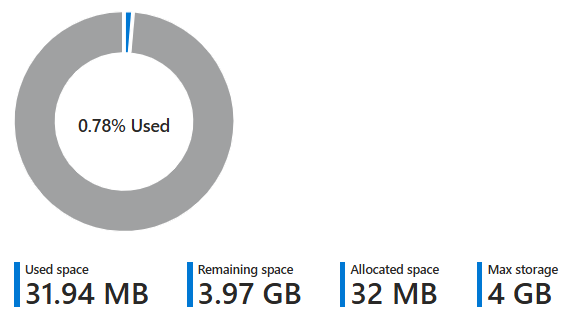

### Overview
The database used in this project is hosted on Azure SQL and consists of the following tables:

1. **`dbo.prices`**:
   - **item_id**: Foreign Key linking to `dbo.items`. Primary Key.
   - **price_usd**: The item's selling price in USD.
   - **original_price_usd**: The item's original price before any discount.
   - **discount_percentage**: The discount percentage applied.
   - **discount_amount_usd**: The monetary discount amount.
   - **shipping_cost_usd**: The shipping cost in USD.
   - **date_time**: The timestamp of when the data was collected. Primary Key.

2. **`dbo.items`**:
   - **item_id**: Primary Key identifying the item.
   - **title**: The item's name or description.
   - **brand**: The brand of the item (e.g., Dyson).
   - **url**: The URL of the item's listing.
   - **category_id**: Foreign Key linking to `dbo.categories`.
   - **condition_id**: Foreign Key linking to `dbo.conditions`.
   - **item_location_country_id**: Foreign Key linking to `dbo.countries`.
   - **item_location_city**: The city where the item is located.
   - **marketplace_id**: The eBay marketplace where the item is listed.
   - **searching_marketplace**: The marketplace used for data collection.

3. **`dbo.categories`**:
   - **category_id**: Primary Key identifying the category.
   - **category_name**: The name of the category (e.g., Vacuum Cleaners).

4. **`dbo.conditions`**:
   - **condition_id**: Primary Key identifying the condition.
   - **condition_name**: The condition of the item (e.g., New, Refurbished).

5. **`dbo.countries`**:
   - **country_id**: Primary Key identifying the country (ISO alpha-2 code).
   - **country_name**: The full name of the country.

6. **`dbo.reviews`**:
   - **review_id**: Primary Key identifying the review.
   - **item_id**: Foreign Key linking to `dbo.items`.
   - **reviewer_name**: The name of the reviewer.
   - **review_score**: The score given by the reviewer.
   - **review_text**: The content of the review.
   - **review_date**: The date of the review.
   - **review_type**: The type of review (Positive, Neutral, or Negative).

7. **`dbo.sellers`**:
   - **seller_id**: Primary Key identifying the seller.
   - **seller_username**: The seller's username.
   - **seller_feedback_score**: The total feedback score of the seller.
   - **seller_positive_feedback_percentage**: The percentage of positive feedback.

8. **`dbo.seller_item_performance`**:
   - **item_id**: Foreign Key linking to `dbo.items`. Primary Key.
   - **seller_id**: Foreign Key linking to `dbo.sellers`. Primary Key.
   - **number_sold**: The total number of units sold by the seller.
   - **number_available**: The number of units available for sale.
   - **reviews_num**: The total number of reviews for the item.
   - **item_positive_feedback_percentage**: The percentage of positive feedback for the item.
   - **date_time**: The timestamp of when the data was collected. Primary Key.

This normalized database design ensures efficient storage, easy querying, and seamless integration with Power BI for advanced analytics.

### Database ERD
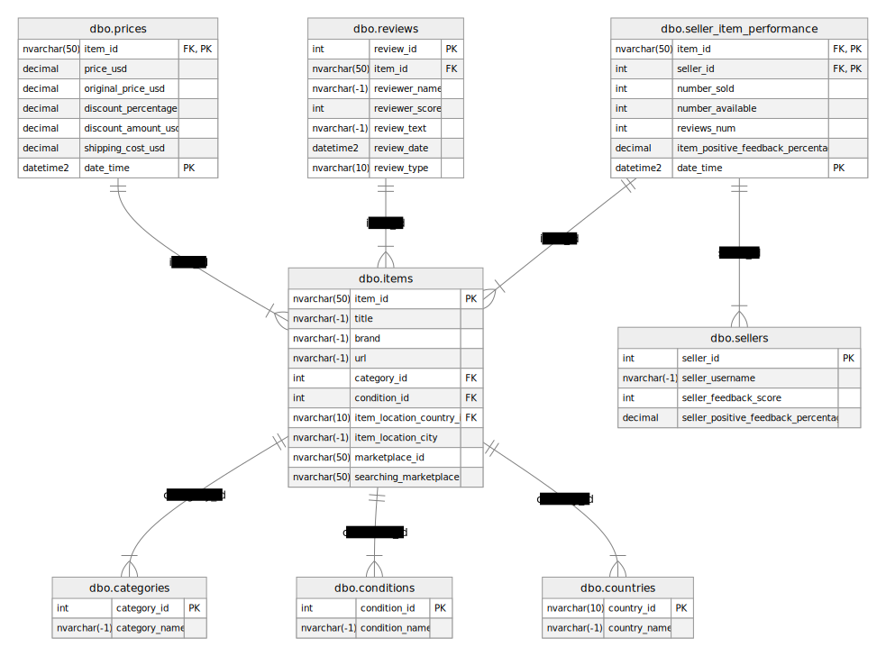

## PowerBI Data Transofrmation
1. **Transforming table `conditions`**

The new table of the items conditions `conditions_grouped` was generated based on the `condtitions` table:

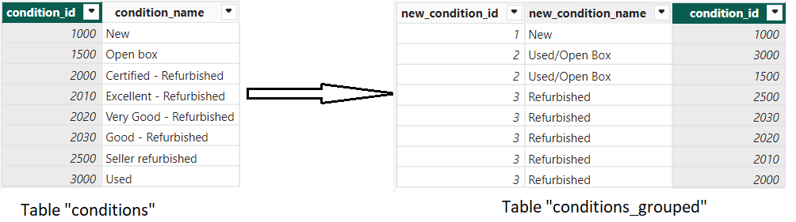

This approach of grouping values helped to reduce number of conditions and to avoid situations when there are too few units of the particular condition for its proper analyzing. 

2. **Replacing null-values of the `shipping_price_usd` column**

I separately calculated average value of the `shipping_price_usd` for both marketplaces (eBay IE and eBay US) and filled null-values with this calculated `avg_shipping_cost` based on item's marketplace:

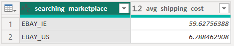

To achieve it, I used Power Query Editor and Power Query M formula.

3. **Calculating `revenue` for each item**

Since eBay API does not provide price data for each unit sold, I calculated revenue of each item based on the formula:

   `Revenue = Item Price * Number Sold`

To achieve it, I used DAX.

## PowerBI Model View

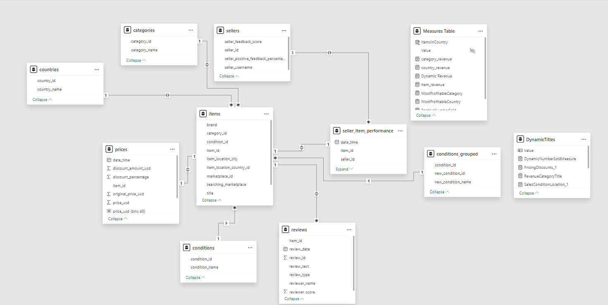

**Additional tables were added to the PowerBI model:**
1. **`Measures Table`:** this table consolidates calculated measures for the project, providing a structured location for key performance indicators (KPIs) and other aggregated metrics.
 - `category_revenue`: Calculates revenue for each product category.
 - `country_revenue`: Tracks revenue by country.
 - `DynamicRevenue`: A dynamic measure to calculate revenue based on filters applied in reports.
 - `item_revenue`: Revenue for individual items.
 - `MostProfitableCategory`: Identifies the product category generating the highest revenue.
 - `MostProfitableCountry`: Identifies the country generating the highest revenue.
 - `PositiveNumberSold`: Ensures only positive sales figures are included in calculations.
 - `total_revenue`: A dynamic measure used for cards showing the total revenue.

2. **`Conditions_Grouped Table`:** this table simplifies and groups item conditions, making it easier to analyze trends and patterns related to item conditions.
 - `condition_id`: A unique identifier for the condition of items.
 - `new_condition_id`: A mapped ID for grouped or aggregated conditions.
 - `new_condition_name`: A more descriptive name for grouped conditions (e.g., combining similar conditions under broader categories like "Used" or "Refurbished").

 3. **`DynamicTitles Table`:** this table provides dynamic titles and measures for enhanced interactivity and customization of reports.
 - `RevenueCategoryTitle`: Dynamically updates titles for category-specific revenue charts.
 - `SoldCategoryTitle`: Dynamically updates titles for category-specific sales volume charts.

## PowerBI Dashboard Screenshots
### Main page

This page is for comparing 2 marketplaces (eBay IE and eBay US) in sales of Dyson products.

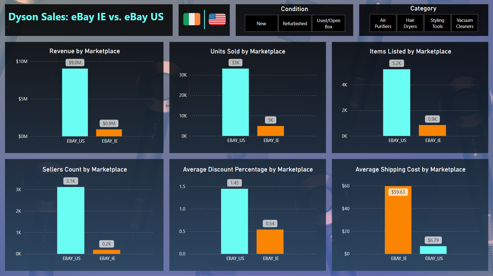

### eBay IE page

This page is for comparing 4 categories of Dyson products (Vacuum Cleaners, Hairdryers, Styling Tools, Air Purifiers) within eBay Ireland marketplace

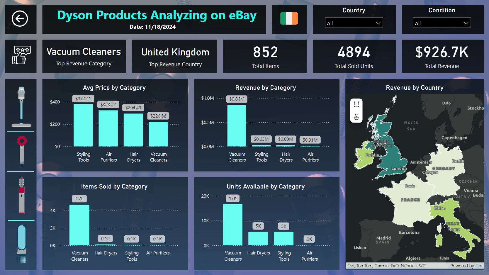

### eBay US page

This page is for comparing 4 categories of Dyson products (Vacuum Cleaners, Hairdryers, Styling Tools, Air Purifiers) within eBay US marketplace

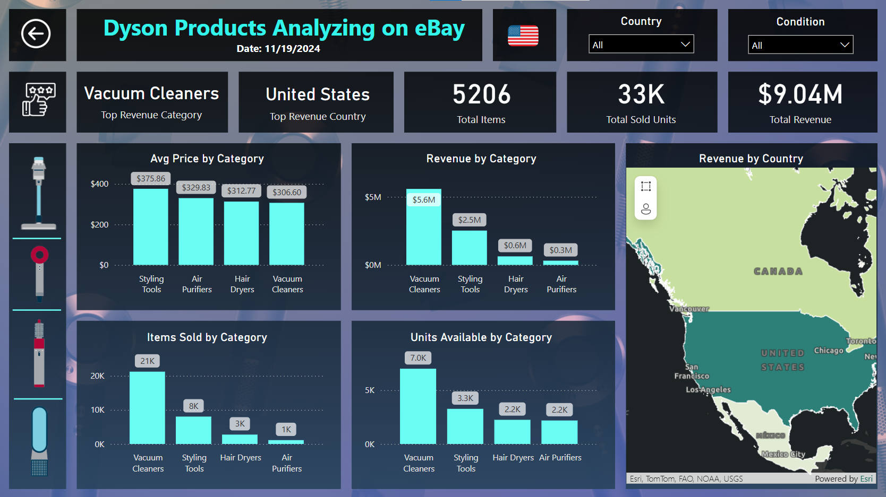

### eBay IE Vacuum Cleaners page

Analyzing Dyson Vacuum Cleaners on eBay Ireland.

**Sellers Performance:**
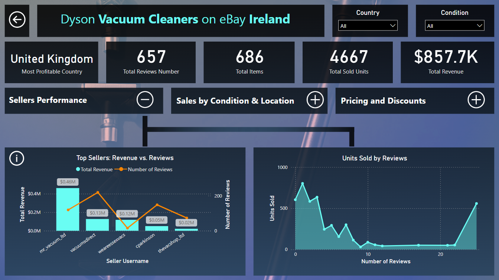

**Sales by Condition & Location:**
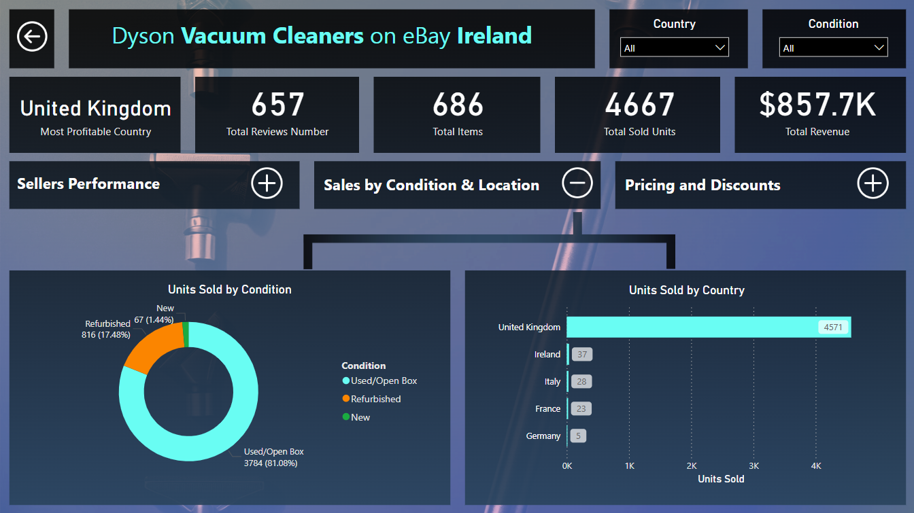

**Pricing and Discounts:**
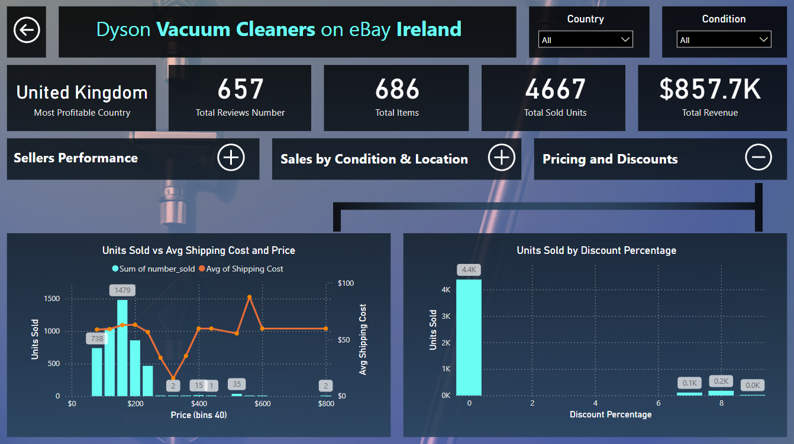

**Same pages for the rest categories of Dyson products on eBay Ireland marketplace**

### eBay US Styling Tools page

Analyzing Dyson Styling Tools on eBay US.

**Sellers Performance:**
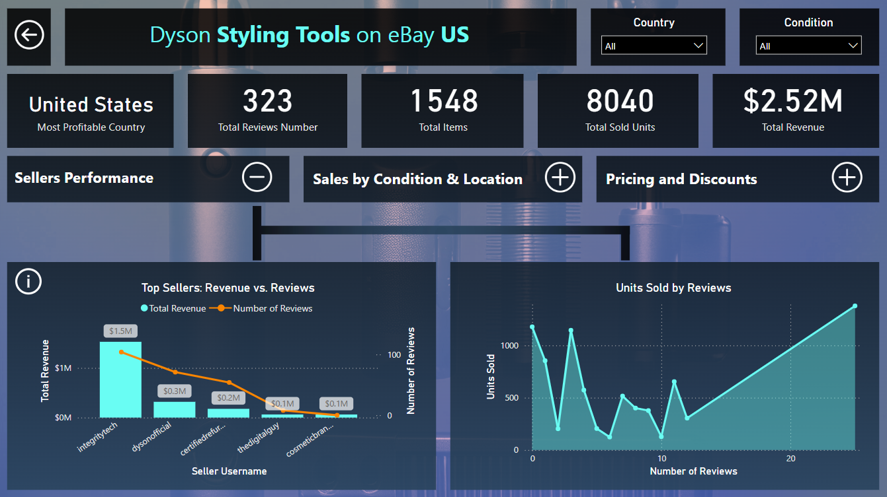

**Sales by Condition & Location:**
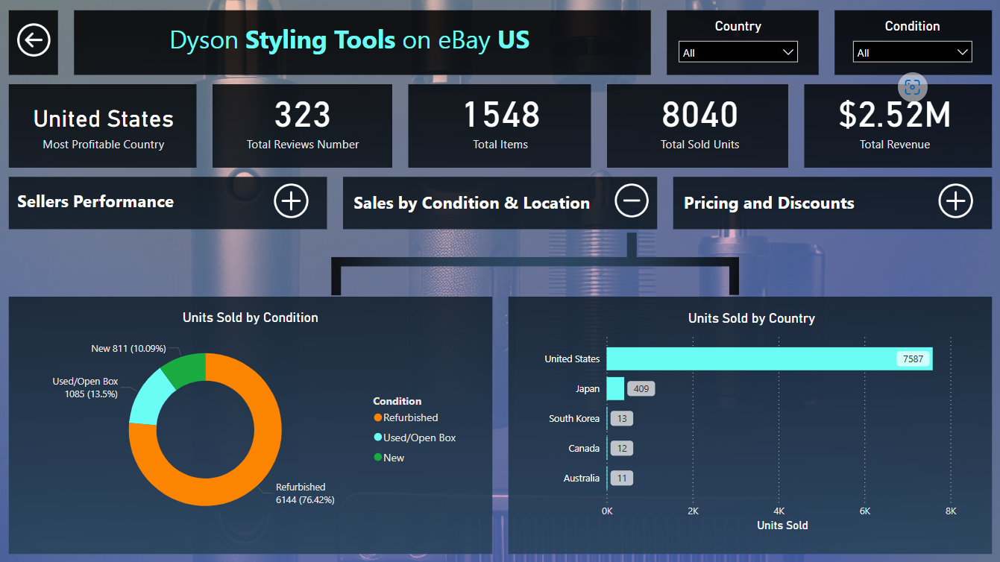

**Pricing and Discounts:**
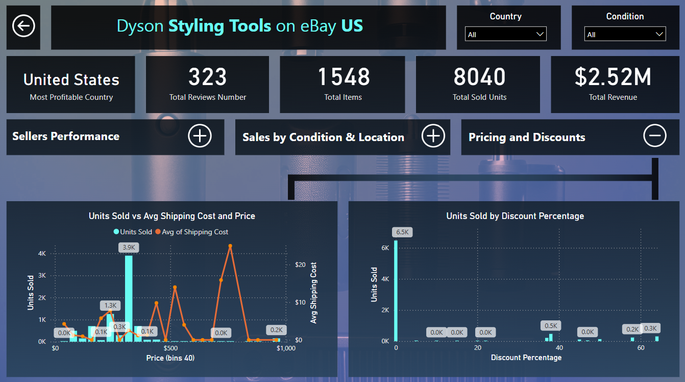

**Same pages for the rest categories of Dyson products on eBay US marketplace**

### Reviews eBay IE page

Customers reviews analyzing of eBay IE separately by splitting reviews by 3 review types (Positive, Negative, Neutral) with leveraging NLP technologies (WordCloud graphs)

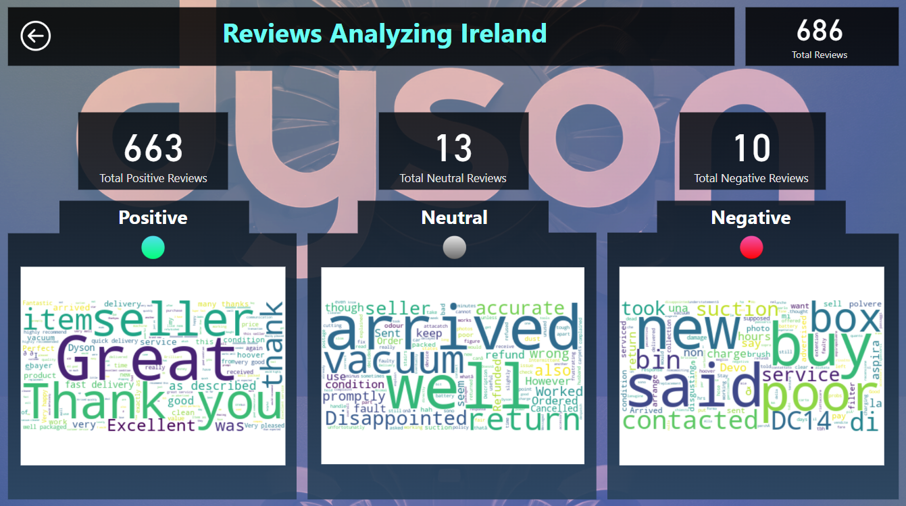

### Reviews eBay US page

Customers reviews analyzing of eBay US separately by splitting reviews by 3 review types (Positive, Negative, Neutral) with leveraging NLP technologies (WordCloud graphs)

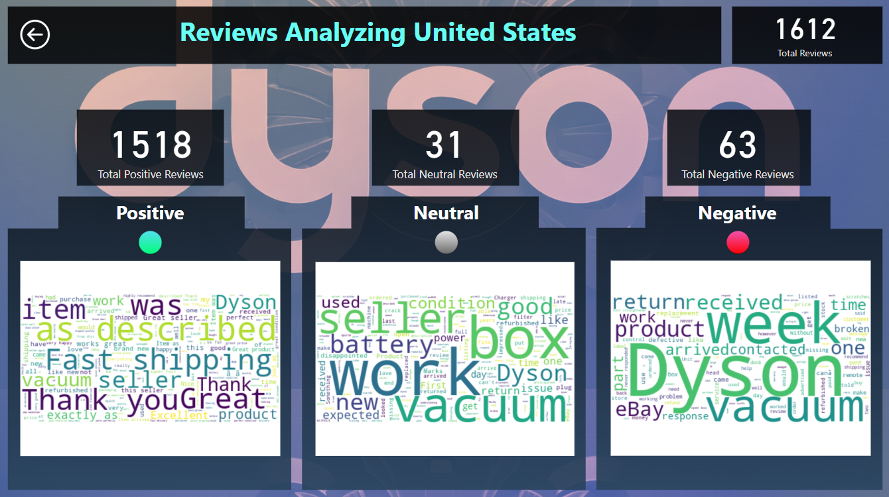

## Short Dashboard Screencast

Click on the image to watch quick dashboard screencast:

## Full Dashboard Screencast

Click on the image to watch full dashboard screencast with comments:

<a href="https://youtu.be/A2tb6A7xYHI" target="_blank">
    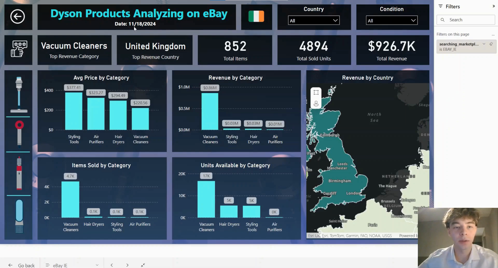
</a>